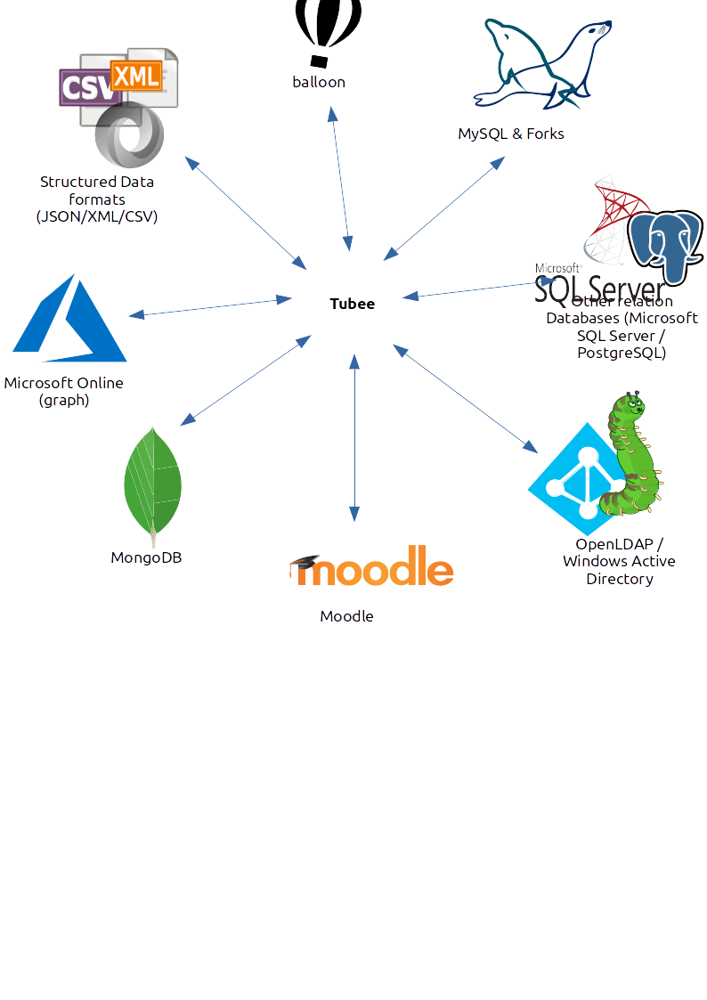

# Overview

First of all, tubee is just a simple data management application. Meaning you may enter data, edit it and remove it.
tubee uses MongoDB as its main database. Therefore this application is highly scalable to your needs. Tubee itself is also 
written for fast performance and is easy scalable.

Well this is not a big deal so far, pretty straight forward stuff. The real tubee features come into play when 
you need to sync your data resources to other systems such as databases, ldap server, structured data files such as XML, web services and more.
tubee can handle various such services (they are called endpoints in tubee). You may import or export such services and create specific time triggered jobs for such tasks.
It is also possible to use tubee as a proxy layer between users and such endpoints. Meaning you can have all tubee features for endpoints. Where tubee also glances is, you can
query those very endpoints with the same query language.
tubee acts as a central data manager and proxy layer between various services.

tubee comes with a full featured REST API and provides [OpenAPI](https://github.com/OAI/OpenAPI-Specification) schemas.
Everything in tubee is a resource, a namespace, a collection, data itself and so on. Meaning you manipulate resources which are stored
on the tubee server. tubee acts as a user-friendly data management engine. Unlike (most) native databases, tubee provides features like LDAP authentication, OpenID-connect integration,
schema based collections of data obejcts, handles object relations, provides a nice HTTP API and much more.

## More features

* Namespace support
* Supports Import/Export to and from various different technologies
* Resource versioning
* Full asynchronous sync jobs
* Time triggered sync jobs
* RBAC
* Proxy for supported endpoints (Access endpoints via the tubee layer)
* Query rewriting for different endpoints (Query data from endpoints with the same query language)
* Attribute mapping between tubee and endpoints
* Attribtue scripting, rewriting and more
* Attribute map workflows
* Full featured OpenAPI v2 REST API
* SDK for 3rt party software
* Published as debian package, tar archive and docker image
* Full support for a cloud native deployment like on Kubernetes
* Perfectly scalable for your needs
* Console client for Linux, Windows and OSX

## Endpoints



* Endpoints
    * LDAP (OpenLDAP, ActiveDirectory and other LDAP server)
    * Various SQL Databases (PDO, All relational SQL database engines)
    * Native MySQL/MariaDB
    * MongoDB
    * Moodle 
    * balloon
    * ODataRest (Like Microsoft online (Office365 and more))
    * XML (via different storage backends, see Storage drivers)
    * CSV (via different storage backends, see Storage drivers)
    * JSON (via different storage backends, see Storage drivers)
    * Binary Images (via different storage backends, see Storage drivers)
    * Ucs (Univetion Corporate Server)
* Storage drivers for data formats:
    * LocalFilesystem
    * balloon cloud server
    * SMB (Windows/Samba share via smb)
    * Stream (HTTP,FTP and more)

## Resource types

The tubee server works with various different resource types.

| Resource      | Description  |
| ------------- |--------------|
| Namespace | Resources like collections must be part of a single namespace.  |
| Collection | A collection is group of similar data objects. Each collection holds data objects and is part of a namespace.|
| Endpoint | An endpoint represents a remote server for proxy, import from, or export to. |
| DataObject  | An actual object which must be part of a collection. |
| DataObjectRelation  | Represents a relationship between data objects. |
| EndpointObject  | Besides data objects there are also endpoint objects. The diference is that an endpoint object represents the state of an object on an endpoint. |
| Workflow   | A workflow defines how and what data should be synchronized between endpoints and collections. A workflow is always attached to an endpoint.|
| GarbageWorkflow   | Similar to a Workflow but only applies to DataObjects which are not available from a source endpoint anymore.|
| Secret  | Holds sensible data which can be injected into other resources. Usually secrets injected into endpoint resources. |
| User  | A simple user with password authentication. (You may also use OpenID-connect or LDAP auth adapter instead local user resources) |
| AccessRole  | Defines an access role which can be used to gain access. Authenticated users are are part of an access-rule. |
| AccessRule  | Create access rules (RBAC) based on HTTP requests. |
| Job | A jobs defines what endpoints/collections should be synchronized and at what time/interval. |
| Process | A process represents a single execution of a job. |
| Log | Each process/job will create log resources which can be requested for Jobs, Processes, Collections, Endpoints and DataObjects. |


## Resource overview

A resource is always constructed the same, each resources contains attributes like name, version, created and changed timestamps, secret mounts, status, the type of the resource and _links.
Usually those attributes are immutable once created. 
However most resources contain a data field where mutable data is stored. Some resources may offer a field status where the status of the resource gets represented.

```yaml
_links:
  self:
    href: >-
      https://localhost:8090/api/v1/namespaces/foo/collections/accounts/endpoints/mssql
  namespace:
    href: 'https://localhost:8090/api/v1/namespaces/foo'
  collection:
    href: 'https://localhost:8090/api/v1/namespaces/foo/collections/accounts'
id: 5bd1ab2e03541800194579b2
name: mssql
version: 3
created: '2018-10-25T11:38:23+00:00'
changed: '2018-11-16T14:00:46+00:00'
secrets:
  - secret: foo
    key: bar
    to: data.resource.passwd
kind: PdoEndpoint
namespace: foo
collection: accounts
data:
  type: source
  options:
    flush: false
    import:
      - person_id
    filter_one: null
    filter_all: null
  resource:
    dsn: 'sqlsrv:server=tcp:dbserv.local,1433 ; Database = foo'
    username: tubee
    options: []
  table: mytable
status:
  available: true
```

### Resource naming
The resource name is the identifier of each resource. The name has to be unique in its own resource context. For example there can be multiple endpoint resources called foo but they must not be attached to the same collection.
A resource name is immutable. Meaning once a resource has been created, the name can not be changed. However it still possible to remove the resource and create it with another name.
There are only certain characters allowed for a resource name: A-Z, a-z, 0-9 and . _ and -, everything else will get rejected by the server.
